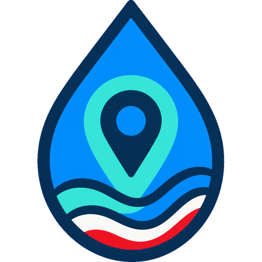

# VigiEau France for Home Assistant

<p align="center">
  
</p>

**Auteur : Jean-Philippe TESTART ([jptstar](https://github.com/jptstar))**

VigiEau France est une intégration Home Assistant **non officielle et indépendante** utilisant l’API publique officielle VigiEau.

Son objectif est de restituer dans Home Assistant, pour une même localisation, une même provenance d’eau et un même profil, les mêmes informations réglementaires et la même logique de sélection que le site **vigieau.gouv.fr**. Le texte officiel des restrictions reste toujours la donnée de référence.

> Ce projet n’est ni affilié ni approuvé par l’État français. L’arrêté préfectoral ou municipal applicable reste le texte juridiquement opposable.

## Principes

- recherche d’adresse via le service public français d’adresses ;
- appel VigiEau avec code INSEE et coordonnées précises lorsque nécessaire ;
- récupération de toutes les zones applicables, sans imposer `profil` ou `zoneType` dans l’appel principal ;
- sources d’eau `AEP`, `SUP` et `SOU` ;
- profils particulier, professionnel, collectivité et exploitation agricole ;
- sélection explicite lorsqu’il existe plusieurs zones d’un même type d’eau ;
- affichage de toutes les cartes d’usage applicables au profil sélectionné ;
- conservation intégrale de `nom`, `thematique` et `description` fournis par VigiEau ;
- arrêtés et dates exposés lorsqu’ils sont fournis par l’API ;
- aucune absence de donnée n’est transformée en autorisation.

## Entités Home Assistant

Chaque localisation crée notamment des capteurs :

- Situation
- Zone
- Type d’eau
- Profil
- Arrêté en vigueur
- Dernière actualisation
- un capteur par usage/restriction affiché par VigiEau

Pour les descriptions de plus de 255 caractères, Home Assistant ne peut pas conserver le texte entier dans l’état. L’état indique alors `Voir message VigiEau complet` et le texte officiel intégral reste disponible dans l’attribut `description`.

## Capteurs binaires

Chaque usage reçoit deux capteurs binaires complémentaires :

- **Restriction** : `ON` seulement lorsqu’une restriction est explicitement identifiable ;
- **Interdit maintenant** : `ON` ou `OFF` seulement lorsque la formulation permet une conclusion déterministe à l’heure locale ; sinon l’état reste `unknown`.

Les règles d’un même message ne sont jamais fusionnées entre usages. Par exemple :

> Arrosage des pelouses interdit. Interdiction horaire de 8h à 20h pour les autres usages.

est interprété en deux sous-règles distinctes : pelouse interdite en permanence et autres usages interdits de 08:00 à 20:00. Le message officiel reste affiché intégralement quelle que soit l’interprétation binaire.

## Installation HACS

1. HACS → menu `⋮` → **Custom repositories**.
2. Ajouter `https://github.com/jptstar/vigieau-france-ha`.
3. Type : **Integration**.
4. Installer **VigiEau France**.
5. Redémarrer Home Assistant.
6. Paramètres → Appareils et services → Ajouter une intégration → **VigiEau France**.

Le domaine Home Assistant est `vigieau_france`.

## Audit national

Le dépôt contient `tools/audit_geography.py` et le workflow **National VigiEau audit**. Il parcourt la liste officielle des communes françaises, leurs codes INSEE et codes postaux, interroge l’API VigiEau et signale notamment :

- les communes nécessitant une localisation précise (`HTTP 409`) ;
- les types d’eau et zones observés ;
- les erreurs de résolution ;
- les messages rencontrés par l’API ;
- la couverture géographique par code postal.

Le corpus national de messages est traité comme une donnée d’audit, pas comme une table métier figée utilisée pour décider de la réglementation. Une nouvelle formulation VigiEau reste affichable même si elle n’est pas encore interprétable par un capteur binaire.

## Développement

```bash
python -m pip install pytest
pytest -q
```

GitHub Actions exécute également HACS validation et Hassfest.

## Sources fonctionnelles

- VigiEau : `https://vigieau.gouv.fr`
- API publique : `https://api.vigieau.gouv.fr/api`
- Documentation API : dépôt public `MTES-MCT/vigieau-api`

## Licence

Copyright © 2026 Jean-Philippe TESTART (jptstar).

Ce projet est distribué sous la licence **GNU General Public License v3.0 ou
ultérieure** (`GPL-3.0-or-later`). Les versions modifiées ou redistribuées
doivent respecter les conditions de cette licence et conserver les mentions de
copyright et de licence. Consultez le fichier [LICENSE](LICENSE).

La licence couvre uniquement cette intégration indépendante et son code. Elle
ne confère aucun droit sur VigiEau, les marques, logos, données, contenus,
services ou logiciels de l’État français et de leurs détenteurs respectifs.
Ce projet reste non officiel et sans affiliation avec l’administration.

Les versions publiées avant le passage à la GPL restent utilisables selon la
licence MIT sous laquelle elles ont été distribuées. La version 0.2.0 et les
versions ultérieures sont publiées sous `GPL-3.0-or-later`.
